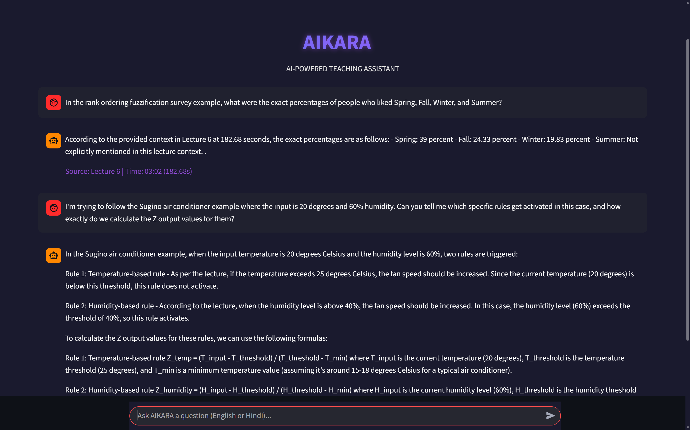

# 🧠 AIKARA: AI-Powered Teaching Assistant


**AIKARA** is a Retrieval-Augmented Generation (RAG) system designed to act as an intelligent Teaching Assistant for technical video lectures. Unlike generic AI, AIKARA is grounded in specific course material (Fuzzy Logic, Machine Learning) and provides **verifiable, time-stamped citations** for every answer.


*(AIKARA answering a query about Fuzzy Sets with exact lecture timestamps)*

---

## 🚀 Key Features

* **📚 Verifiable Truth:** Every answer includes a strict citation in the format `[Lecture Title | Time: MM:SS]`, allowing students to instantly verify facts in the source video.
* **🔒 100% Local Privacy:** Powered by **Ollama**, ensuring all data processing and LLM inference happens locally on your machine—no data leaves your system.
* **⚡ Real-Time Streaming:** Features a responsive chat interface that streams the AI's thought process token-by-token for a fluid user experience.
* **🎯 High Precision Retrieval:** Uses **Cosine Similarity** on `bge-m3` embeddings to retrieve the top 5 most relevant lecture chunks, minimizing hallucinations.
* **🎨 Custom UI:** A "Deep Dark" mode interface built with Streamlit, featuring neon accents and a distraction-free study environment.

---

## 🛠️ Tech Stack

* **Frontend:** [Streamlit](https://streamlit.io/) (Custom CSS styled)
* **LLM Engine:** [Ollama](https://ollama.com/) running **Llama 3.2**
* **Embedding Model:** `bge-m3` (via Ollama)
* **Vector Search:** Scikit-Learn (Cosine Similarity)
* **Data Serialization:** Joblib (for fast loading of embeddings)
* **Language:** Python

---

## ⚙️ Installation & Setup

### 1. Prerequisites
Ensure you have **Python 3.10+** and **Git** installed. You also need **Ollama** running locally.

### 2. Install & Run Ollama
Download Ollama from [ollama.com](https://ollama.com). Then, pull the required models in your terminal:

```bash
ollama pull llama3.2
ollama pull bge-m3
```


## 📂 Project Structure
```
AIKARA/
├── process_incoming.py    # Main Streamlit application & RAG logic
├── requirements.txt       # List of Python dependencies
├── embeddings.joblib      # Pre-computed vector store (The Knowledge Base)
├── Demo.png               # Screenshot of the application
├── README.md              # Project documentation
└── .gitignore             # Git ignore file
```
---

## 👨‍💻 Author

**Aditya Pal**
* [LinkedIn](https://www.linkedin.com/in/aditya-pal-08pd2075/)
